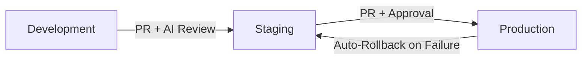

# 🚀 AI-Driven CI/CD Deployment Guide

## Overview

This project uses a **95% AI-automated** CI/CD pipeline powered by Claude AI, GitHub Actions, Render, and Supabase.

## 🔄 Deployment Flow



### Environment Branches

| Environment | Branch | URL | Auto-Deploy |
|------------|--------|-----|-------------|
| Development | `development` | https://telbot-dev.onrender.com | ✅ On push |
| Staging | `staging` | https://telbot-staging.onrender.com | ✅ On merge |
| Production | `master` | https://telbot-production.onrender.com | ✅ On merge (with approval) |

## 📋 Deployment Process

### 1️⃣ Development Deployment

```bash
# Make changes
git add .
git commit -m "feat: your feature"
git push origin development
```

**What happens automatically:**
- 🤖 Claude analyzes code for risks
- 🧪 Tests run automatically
- 📦 Deploys to dev environment if safe
- 💬 Telegram notification sent

### 2️⃣ Staging Deployment

```bash
# Create PR from development to staging
gh pr create --base staging --head development --title "Deploy to staging"
```

**What happens automatically:**
- 🤖 Claude reviews the PR
- 🔍 Checks for database migrations
- 🧪 Runs integration tests
- 📦 Auto-deploys on merge
- 💬 Notifies team via Telegram

### 3️⃣ Production Deployment

```bash
# Create PR from staging to master
gh pr create --base master --head staging --title "Deploy to production"
```

**What happens automatically:**
- 🤖 Claude performs deep analysis
- ⚠️ Requires manual approval
- 🧪 Full test suite runs
- 📦 Deploys with health checks
- 🔄 Auto-rollback if health check fails
- 💬 Critical notifications sent

## 🛠️ Manual Deployment

For emergency deployments or testing:

```bash
# Trigger manual deployment
gh workflow run manual-deploy.yml \
  -f environment=production \
  -f skip_tests=false \
  -f force_deploy=false \
  -f reason="Emergency fix for critical bug"
```

## 📊 Monitoring

### Check Deployment Status

```bash
# View recent deployments
gh run list --workflow=ai-cicd-pipeline.yml --limit=5

# Watch deployment in real-time
gh run watch

# View logs for specific run
gh run view [run-id] --log
```

### Health Checks

```bash
# Check service health
curl https://telbot-dev.onrender.com/health
curl https://telbot-staging.onrender.com/health
curl https://telbot-production.onrender.com/health
```

### Telegram Notifications

All deployments send notifications to Telegram with:
- ✅/❌ Success/Failure status
- 📊 Risk level assessment
- 🤖 AI summary of changes
- 🔗 Link to GitHub Actions run

## 🔄 Rollback Procedures

### Automatic Rollback

Triggered automatically when:
- Health check fails after deployment
- Critical error detected
- Service doesn't respond within 5 minutes

### Manual Rollback

#### Option 1: Via GitHub (Recommended)

```bash
# Revert the merge commit
git revert -m 1 HEAD
git push origin master
```

#### Option 2: Via Render Dashboard

1. Go to [Render Dashboard](https://dashboard.render.com)
2. Select the service (telbot-production)
3. Click "Deploys" tab
4. Find previous successful deployment
5. Click "Redeploy"

#### Option 3: Via API

```bash
# Get deployment history
curl -H "Authorization: Bearer $RENDER_API_KEY" \
  https://api.render.com/v1/services/srv-d2h9ckggjchc73bumn60/deploys

# Redeploy specific commit
curl -X POST \
  -H "Authorization: Bearer $RENDER_API_KEY" \
  -H "Content-Type: application/json" \
  -d '{"commitId": "PREVIOUS_COMMIT_SHA"}' \
  https://api.render.com/v1/services/srv-d2h9ckggjchc73bumn60/deploys
```

### Database Rollback

```bash
# Connect to Supabase
supabase link --project-ref prtfkiodnbogqfcztruj

# List migrations
supabase migration list

# Create down migration
supabase migration new rollback_[migration_name]

# Apply rollback
supabase db push
```

## 🔑 Environment Variables

### Required Secrets in GitHub

| Secret | Description | Where to Get |
|--------|-------------|-------------|
| `ANTHROPIC_API_KEY` | Claude AI API key | https://console.anthropic.com |
| `RENDER_API_KEY` | Render deployment key | https://dashboard.render.com/account/api-keys |
| `TELEGRAM_BOT_TOKEN` | Bot token for notifications | @BotFather on Telegram |
| `TELEGRAM_CHAT_ID` | Chat ID for notifications | Use @userinfobot |
| `SUPABASE_ACCESS_TOKEN` | Supabase CLI token | https://app.supabase.com/account/tokens |

### Service-Specific Variables

Set these in Render Dashboard for each service:

```env
# Database
SUPABASE_URL=https://[project].supabase.co
SUPABASE_ANON_KEY=eyJ...
SUPABASE_SERVICE_KEY=eyJ...

# Telegram
TELEGRAM_BOT_TOKEN=bot_token_here
WEBHOOK_URL=https://service.onrender.com/webhook

# Environment
ENVIRONMENT=development|staging|production
LOG_LEVEL=INFO
```

## 🧪 Testing

### Run Tests Locally

```bash
# Install test dependencies
pip install -r requirements-test.txt

# Run all tests
pytest

# Run specific test categories
pytest -m health  # Health checks only
pytest -m bot     # Bot tests only
pytest -m api     # API tests only

# Run with coverage
pytest --cov=. --cov-report=html
```

### Test in CI/CD

Tests run automatically on:
- Every push to development/staging/master
- Every pull request
- Manual workflow dispatch

## 🚨 Troubleshooting

### Common Issues

#### Deployment Stuck

```bash
# Check GitHub Actions
gh run list --workflow=ai-cicd-pipeline.yml

# Check Render logs
curl -H "Authorization: Bearer $RENDER_API_KEY" \
  https://api.render.com/v1/services/[service-id]/deploys/[deploy-id]
```

#### Health Check Failing

1. Check service logs in Render
2. Verify environment variables
3. Test database connection
4. Check Telegram webhook

#### AI Analysis Failing

1. Verify `ANTHROPIC_API_KEY` is set
2. Check API quota
3. Reduce diff size (commit smaller changes)

#### Database Migration Failed

```bash
# Check migration status
supabase migration list

# Reset to clean state (dev only)
supabase db reset

# Apply migrations manually
supabase migration up
```

## 📈 Performance Metrics

### Success Criteria

- ✅ 95%+ deployments succeed without manual intervention
- ⏱️ < 5 minute deployment time
- 🔄 Zero-downtime deployments
- 🛡️ Automatic rollback on failures
- 📊 AI risk assessment accuracy > 90%

### Current Performance

| Metric | Target | Current |
|--------|--------|----------|
| Automation Rate | 95% | - |
| Deploy Time | < 5 min | - |
| Success Rate | > 95% | - |
| Rollback Time | < 2 min | - |

## 🔐 Security

### Best Practices

1. **Never commit secrets** - Use GitHub Secrets
2. **Review AI suggestions** - Don't blindly trust
3. **Test in staging** - Always test before production
4. **Monitor alerts** - Watch Telegram notifications
5. **Regular backups** - Supabase handles automatically

### Security Scanning

Automatic scanning for:
- API keys in code
- SQL injection vulnerabilities
- Dangerous operations (DROP TABLE, rm -rf)
- Exposed credentials

## 📚 Additional Resources

- [GitHub Actions Docs](https://docs.github.com/en/actions)
- [Render Docs](https://render.com/docs)
- [Supabase Docs](https://supabase.com/docs)
- [Claude API Docs](https://docs.anthropic.com)
- [Telegram Bot API](https://core.telegram.org/bots/api)

## 🆘 Support

For issues or questions:

1. Check this guide
2. Review GitHub Actions logs
3. Check Telegram for notifications
4. Contact the team

---

*Last updated: December 2024*
*Version: 1.0.0*