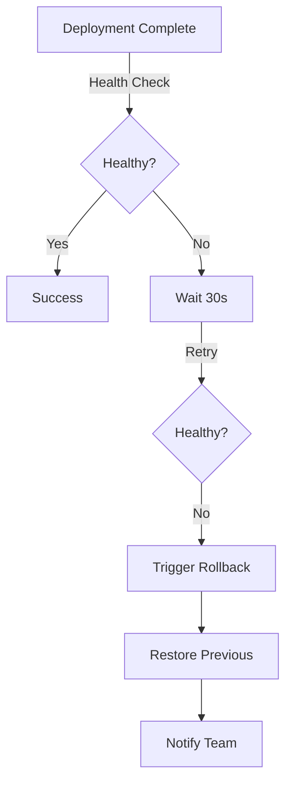

# 🔄 Rollback Procedures

## Quick Reference

| Scenario | Method | Time | Impact |
|----------|--------|------|--------|
| Failed health check | Automatic | < 2 min | None |
| Bad deployment | GitHub revert | < 5 min | Minimal |
| Database issue | Migration rollback | < 10 min | Potential data loss |
| Complete failure | Render redeploy | < 5 min | Service restart |

## 🚨 Automatic Rollback

### Triggers

Automatic rollback occurs when:

1. **Health check fails** (3 consecutive failures)
2. **Deployment timeout** (> 10 minutes)
3. **Critical error rate** (> 50% errors)
4. **AI risk assessment** (critical level)

### What Happens



## 🛠️ Manual Rollback Methods

### Method 1: GitHub Revert (Recommended)

```bash
# 1. Identify the bad commit
git log --oneline -10

# 2. Create revert commit
git revert -m 1 <commit-sha>

# 3. Push to trigger deployment
git push origin master
```

**Pros:** Clean git history, triggers CI/CD
**Cons:** Creates new commit

### Method 2: Git Reset (Emergency)

```bash
# ⚠️ DANGER: Only use if revert fails

# 1. Reset to previous commit
git reset --hard <previous-commit-sha>

# 2. Force push
git push --force origin master
```

**Pros:** Immediate
**Cons:** Rewrites history, requires force push

### Method 3: Render Dashboard

1. Navigate to https://dashboard.render.com
2. Select service:
   - `telbot-production` for production
   - `telbot-staging` for staging
3. Click "Deploys" tab
4. Find last successful deployment (green status)
5. Click "..." menu → "Redeploy"

**Pros:** No git changes needed
**Cons:** Manual process

### Method 4: Render API

```bash
# Set variables
SERVICE_ID="srv-d2h9ckggjchc73bumn60"  # Production
RENDER_API_KEY="rnd_6MZiXVnDM2svzQjEM0bpa9XKBH8W"

# Get deployment history
curl -H "Authorization: Bearer $RENDER_API_KEY" \
  "https://api.render.com/v1/services/$SERVICE_ID/deploys?limit=10" \
  | jq '.[] | {id, commit, status, createdAt}'

# Redeploy specific commit
COMMIT_SHA="abc123..."  # Previous good commit
curl -X POST \
  -H "Authorization: Bearer $RENDER_API_KEY" \
  -H "Content-Type: application/json" \
  -d "{\"commitId\": \"$COMMIT_SHA\"}" \
  "https://api.render.com/v1/services/$SERVICE_ID/deploys"
```

## 🗄️ Database Rollback

### Identify Migration to Rollback

```bash
# Connect to project
supabase link --project-ref prtfkiodnbogqfcztruj

# List recent migrations
supabase migration list

# Example output:
# 20240101000000_initial_schema.sql (applied)
# 20240102000000_add_users_table.sql (applied)
# 20240103000000_bad_migration.sql (applied) ← Rollback this
```

### Create Rollback Migration

```bash
# Generate rollback migration
supabase migration new rollback_bad_migration
```

Edit the file with inverse operations:

```sql
-- supabase/migrations/20240103000001_rollback_bad_migration.sql

-- Undo the bad migration
DROP TABLE IF EXISTS broken_table;
ALTER TABLE users DROP COLUMN IF EXISTS bad_column;

-- Restore previous state if needed
ALTER TABLE users ADD COLUMN IF NOT EXISTS old_column VARCHAR(255);
```

### Apply Rollback

```bash
# Test locally first
supabase db reset
supabase migration up

# Apply to production
supabase db push --no-verify
```

## 📊 Monitoring During Rollback

### Check Service Status

```bash
# Health endpoint
curl https://telbot-production.onrender.com/health

# Metrics endpoint
curl https://telbot-production.onrender.com/metrics

# Telegram bot status
curl https://api.telegram.org/bot$TELEGRAM_BOT_TOKEN/getWebhookInfo
```

### Watch Logs

```bash
# GitHub Actions logs
gh run watch

# Render logs (via dashboard)
# https://dashboard.render.com/web/srv-d2h9ckggjchc73bumn60/logs

# Supabase logs
supabase logs --tail
```

### Monitor Metrics

- Error rate
- Response time
- Active users
- Database connections
- Memory usage

## 🔥 Emergency Procedures

### Complete Service Failure

1. **Switch to maintenance mode**
   ```bash
   # Update environment variable in Render
   MAINTENANCE_MODE=true
   ```

2. **Rollback to last known good**
   ```bash
   # Use Render API for fastest rollback
   ./scripts/emergency-rollback.sh
   ```

3. **Verify core services**
   - Database connectivity
   - Telegram webhook
   - Authentication

4. **Gradual recovery**
   - Test with single user
   - Monitor for 5 minutes
   - Restore full service

### Data Corruption

1. **Stop writes immediately**
   ```sql
   -- Set database to read-only
   ALTER DATABASE postgres SET default_transaction_read_only = on;
   ```

2. **Backup current state**
   ```bash
   supabase db dump > backup_$(date +%Y%m%d_%H%M%S).sql
   ```

3. **Restore from backup**
   ```bash
   # List available backups
   supabase backups list
   
   # Restore specific backup
   supabase backups restore <backup-id>
   ```

4. **Verify data integrity**
   ```sql
   -- Check row counts
   SELECT table_name, COUNT(*) 
   FROM information_schema.tables 
   WHERE table_schema = 'public'
   GROUP BY table_name;
   ```

## 📝 Post-Rollback Checklist

- [ ] Service is responding (health check passes)
- [ ] Telegram bot is receiving messages
- [ ] Database queries are working
- [ ] No error spikes in logs
- [ ] Users can authenticate
- [ ] Critical features tested
- [ ] Team notified via Telegram
- [ ] Incident report created

## 📋 Rollback Communication Template

### Telegram Notification

```
🔄 ROLLBACK INITIATED

Environment: Production
Reason: [Health check failed / Manual trigger]
Previous version: v1.2.3
Rolling back to: v1.2.2
Estimated time: 5 minutes

Status: In progress...
```

### Incident Report

```markdown
## Incident Report

**Date:** [Date]
**Duration:** [Start time] - [End time]
**Impact:** [Number of users affected]

### Summary
[What happened]

### Root Cause
[Why it happened]

### Resolution
[How it was fixed]

### Action Items
- [ ] Fix identified issue
- [ ] Add test coverage
- [ ] Update monitoring
- [ ] Document lessons learned
```

## 🛡️ Prevention

### Before Deployment

1. **Review AI risk assessment**
2. **Test in staging environment**
3. **Check migration reversibility**
4. **Verify rollback procedure**
5. **Ensure backups are recent**

### Monitoring Setup

```python
# Add to health check
def comprehensive_health_check():
    checks = {
        "database": check_database(),
        "telegram": check_telegram_bot(),
        "redis": check_redis(),
        "disk_space": check_disk_space(),
        "memory": check_memory_usage(),
        "error_rate": check_error_rate()
    }
    
    if any(check["status"] != "healthy" for check in checks.values()):
        trigger_rollback()
    
    return checks
```

## 🔗 Quick Links

- [Render Dashboard](https://dashboard.render.com)
- [Supabase Dashboard](https://app.supabase.com)
- [GitHub Actions](https://github.com/theprogressmethod/telbot/actions)
- [Telegram Bot API](https://api.telegram.org/bot$TOKEN/getWebhookInfo)

---

*Remember: It's better to rollback quickly than to debug in production!*